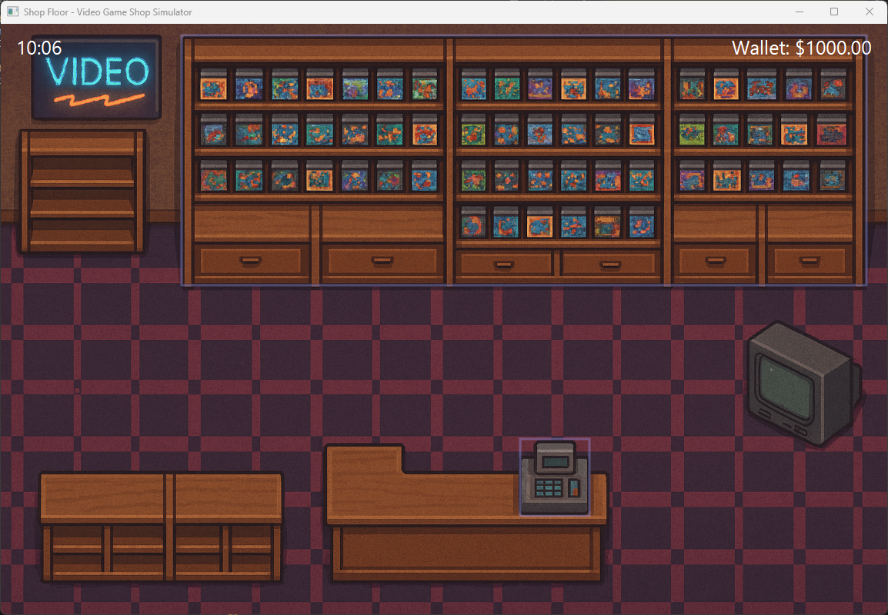
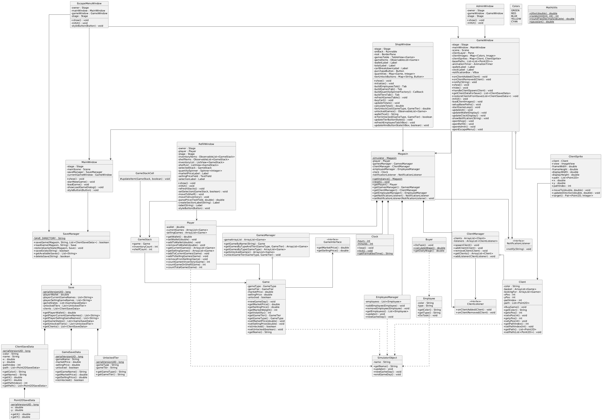

<div align="center">
  <h1 align="center">Video Game Shop Simulator</h1>
  <p align="center">
    A simulation game where you manage your own video game shop.
    <br />
    <br />
    <a href="https://github.com/Askin242/Video-Game-Shop-Simulator/issues">⚠️ Report Bug</a>
    ·
    <a href="https://github.com/Askin242/Video-Game-Shop-Simulator/issues">💡 Request Feature</a>
  </p>
  <p align="center">
    
    
    
  </p>
</div>

---

### 🎮 Overview

Video Game Shop Simulator is a management game where you run a store, manage stock, and interact with customers.



### 🚀 Getting Started

#### Option 1: Download Release
Download the latest release from the [Releases Page](https://github.com/Askin242/Video-Game-Shop-Simulator/releases).

#### Option 2: Build from Source
1. Clone the repository:
   ```bash
   git clone https://github.com/Askin242/Video-Game-Shop-Simulator.git
   ```
2. Build the JAR file using your preferred IDE or build tool.
3. Ensure JavaFX dependencies are properly configured.

#### Running the Game
Once you have the JAR file, you can run the game using the provided batch script:

```bash
./run.bat
```

Or manually with Java (requires JavaFX):

```bash
java --module-path "lib" --add-modules javafx.controls,javafx.fxml -jar "Video-Game-Shop-Simulator.jar"
```

### 🏗️ Architecture



### 🙌 Credits

- **Game design & code**: 
  - [Sylvestre Graziani](https://github.com/Askin242)
  - [Matthieu Rey](https://github.com/MathCat975)
  - [Vincent Guerrini](https://github.com/Yokasashii)

### 📜 License

MIT